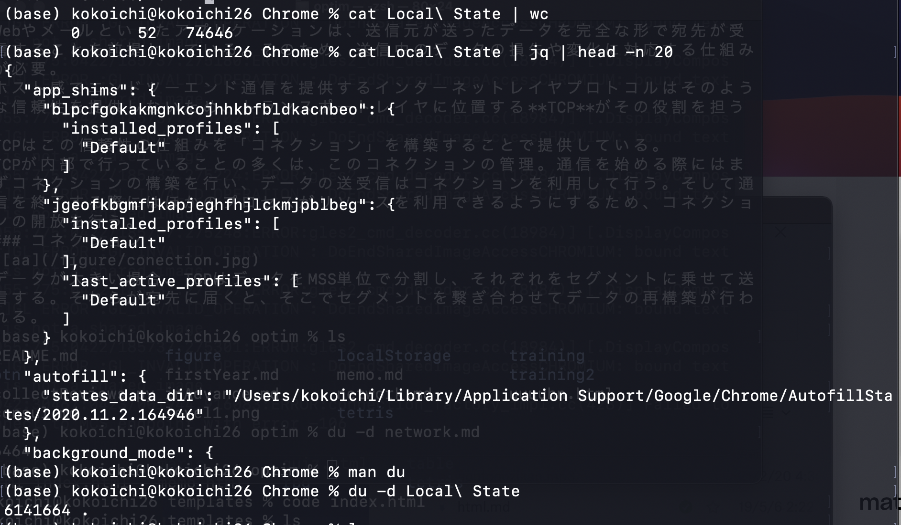

## localStorage とは?
- key, value の形でデータを保存していく
- 保持期間の制限はない
- ブラウザの他のタブからも開ける。あれ？
  - local ファイルを開いてるときのみ！
    - つまり、他のサイト（適当なサーバーからのレスポンス）では別物
      - 別物の localStorage が返ってくる
  - Chrome と safari では共有されてないっぽい
- （以下のBADな点を気にしなくて良いケースでは）使いやすくて良い
- Chromeなら、アプリケーションの中のサブフォルダに SQLite があるらしい
  - ~/Library/Application Support/Google/Chrome/Default/Local Storage
- JSON 形式で保存されていて、自分の環境では 0.6MB くらい




### BAD な点
- stringデータしか保存できない
- 同期的
  - local storageへの操作は同時に1つしか実行できない
  - 複雑なアプリケーションで速度が落ちる
- ストレージ容量は存在する（5 MB）
- 全くセキュアでない（どんな JS からもアクセスできる）

### 他の保存方法との違い
- [Cookies vs Local Storage vs Session（15 min）](https://www.youtube.com/watch?v=GihQAC1I39Q&t=181s)

- 「純粋なJavaScript」という点で cookie と異なる。
- 扱える容量が 10 MB とでかい（cf: max-4 KB @cookie）
- 挙動が全く同じ「sessionStorage」との違いは、ブラウザタブを閉じた瞬間に自動的に削除されるかどうか！


### 学べること
- 

### 使い方
- [使い方デモ（20 min）](https://www.youtube.com/watch?v=k8yJCeuP6I8)

```
localStorage.setItem("name", "domenic");
localStorage.setItem("age", "30");
console.log(localStorage.key(1));
console.log(localStorage.getItem("age"));
localStorage.removeItem("name");
localStorage.clear();
```

### その他 memo
- location.reload?
  - location.reload(true): ウェブサーバのデータからリロード
  - location.reload(false): キャッシュからリロード
- JS で、deep copy
```
let ko2 = JSON.parse(JSON.stringify(ko1))
```

- console で整形して表示させたい
  - console.log(JSON.stringify(obj, null, '\t'));


